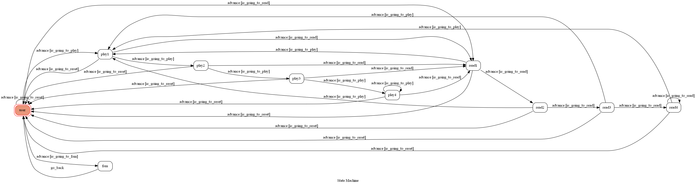
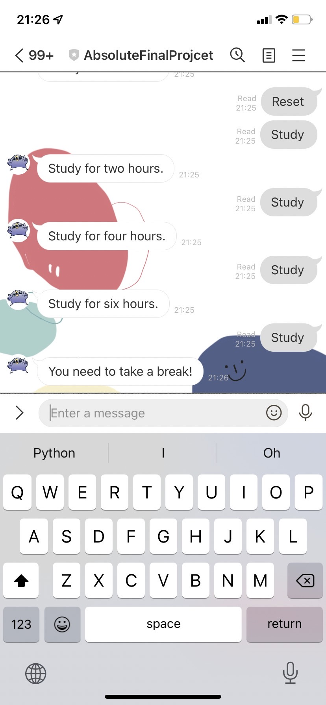
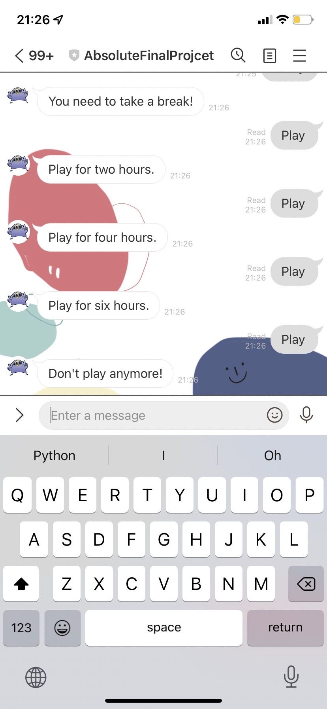
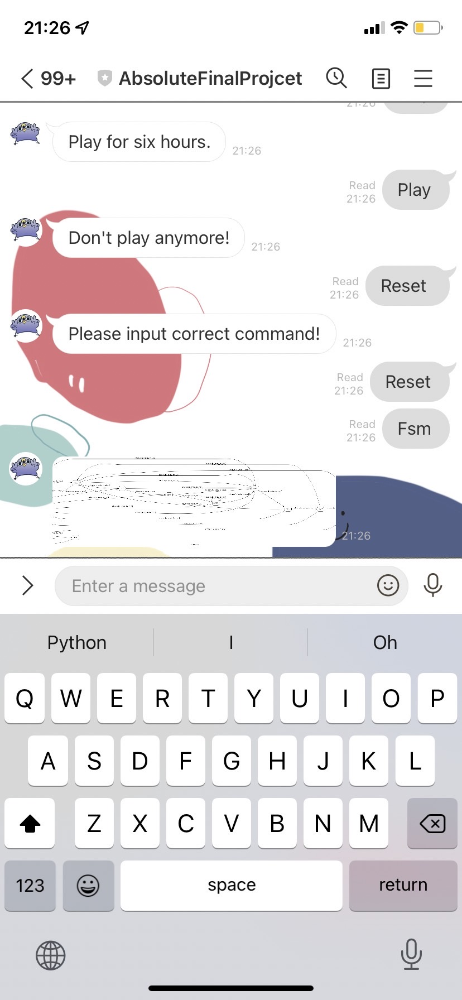

# TOC Project 2022
資訊113 F74094075 張庭菀

## Finite State Machine

## Introduce
This linebot can record your studying and playing time, and also can remind you to study or take a break.

## Usage
* "study" -> Record tow hours for study.
* "play"  -> Record tow hours for play.
* "reset" -> Reset recording.
* "fsm"   -> show fsm.(After input reset)

Every time `user` state is triggered to `advance` to another state, it will `not go_back` to user state after the bot replies corresponding message.

## Bonus

The bot can run properly when there are more than one user.
